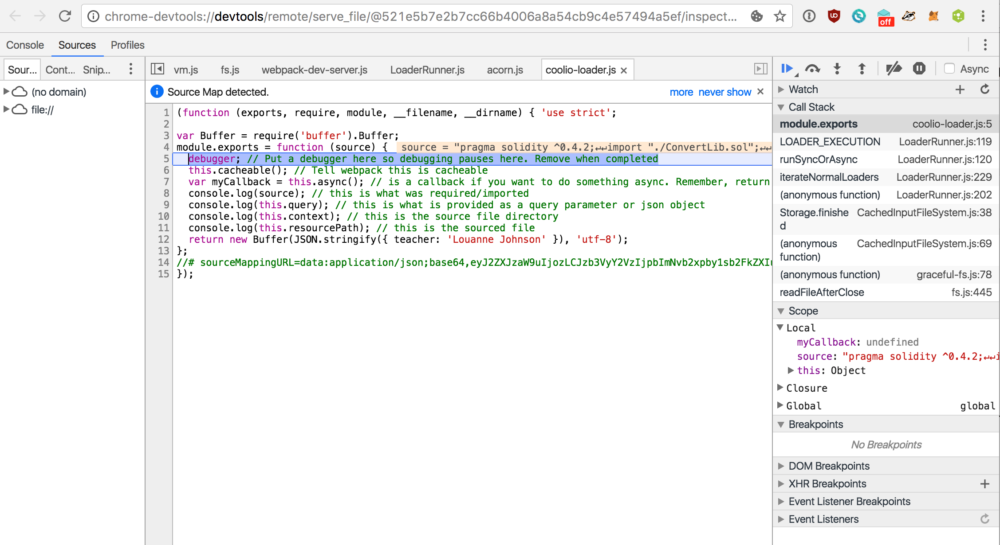

# How to set yourself up to make Webpack Plugins or Loaders.
-----

Need to make your own Webpack 2 plugin or loader? Don't know how or where to begin? I'll go over a quick setup so you can start making plugins to your heart's content! You can see the full results in the [github repo](https://github.com/sogoiii/sample-webpack-dev).

## Who is this for?
You know javascript and have an idea for a plugin or loader.

## Setup Debugging

I will show you how to debug the system on node >= `6.3.0`. The reason is I will be working with the `--inspect` flag that makes debugging fast and easy. If you know how to debug node via `node-inspector` or any other debugger, you can continue. Again, my examples will be for node >= `6.3.0`. I suggest upgrading because in my experience, debugging with `--inspect` is far faster than `node-inspector`.

Great, now let's install [`V8 inspector`](https://chrome.google.com/webstore/detail/nodejs-v8-inspector/lfnddfpljnhbneopljflpombpnkfhggl?hl=en) for Google Chrome. The `V8 inspector` creates a unique URL for debugging each time it's run. The plugin allows you to click a button to hit the correct URL without copy-pasting every time.

```
node --inspect --debug-brk index.js
Debugger listening on port 9229.
Warning: This is an experimental feature and could change at any time.
To start debugging, open the following URL in Chrome:
    chrome-devtools://devtools/remote/serve_file/@521e5b7e2b7cc66b4006a8a54cb9c4e57494a5ef/inspector.html?experiments=true&v8only=true&ws=localhost:9229/node
```

I added the curve-ball flag `--debug-brk` into the mix. It tells node to stop debugging on the first command. Otherwise it will execute the entire script. Without it, a fast script may exit before you can attach the debugger.


## Lets make a loader

A loader will read in `require` or `import` commands and run the attached loader. The way we tell Webpack what loader to run is via the `test` key. Let's look at an example.

```javascript
{
  rules: [
    {
      test: /\.gangstas_paradise/,
      use: [
        { loader: 'json-loader' },
        { loader: 'coolio-loader' }
      ]
    }
  ]
}
```

From the above example, we are telling Webpack to run the loader `coolio-loader` if it ever encounters a file with the extension `gangstas_paradise`. You can specify the `include` or `exclude` keys with paths if desired (`include: './pennsylvania'`). Simply including the loader will not trigger `coolio-loader`. Somewhere in the code it must `require` or `import` a file with `.gangstas_paradise`. Notice how I added the `json-loader` before `coolio-loader`. This is because Webpack goes right to left, so the output of `coolio-loader` goes into `json-loader`.


```javascript
{
  resolveLoader: {
    modules: ['node_modules', 'my-loaders']
  },
  module: {
    rules: [
      {
        test: /\.gangstas_paradise/,
        use: [
          { loader: 'json-loader' },
          { loader: 'coolio-loader' }
        ]
      }
    ]
  }
}
```

By default, Webpack will look in the `node_modules` folder for the given loader. Luckily, Webpack allows us to declare a `resolveLoader` object where we can define where to look for loaders. Above, I added the `resolveLoader` object with the `my-loaders` directory. This allows me to have custom, unpublished loaders. Great for development!

The `coolio-loader.js` file is within the `my-loaders` directory and looks like the following:

```javascript
const Buffer = require('buffer').Buffer
module.exports = function (source) {
  debugger // Put a debugger here so debugging pauses here. Remove when completed
  this.cacheable(); //
  var myCallback = this.async() // is a callback if you want to do something async. Remember, return undefined if you plan on using this callback
  console.log(source) // this is what was required/imported
  console.log(this.query) // this is what is provided as a query parameter or json object
  console.log(this.context) // this is the source file directory
  console.log(this.resourcePath) // this is the sourced file
  return new Buffer(JSON.stringify({ teacher: 'Louanne Johnson' }), 'utf-8')
}
```

The loader needs to return a buffer, otherwise you get an error. For my example, I return a JSON object. I output a few interesting variables that you may need to use. With the setup complete, run the following command and open a tab to the `V8 debugger`.

```
node --inspect --debug-brk node_modules/webpack-dev-server/bin/webpack-dev-server.js
```

When the window loads the debugger, press the play button to start execution. Wait a second and the debugger will reach the `coolio-loader.js` file and pause at the debugger line. You can now debug and do whatever your heart desires. This is where I leave you to your own work. Go load something now!




## Creating a Plugin

A plugin is easier to set up than a loader. I followed the examples from the Webpack [plugin](https://github.com/webpack/docs/wiki/how-to-write-a-plugin) page.

```javascript
var HelloAsyncPlugin = require('./my-plugins/helloAsyncPlugin.js')
{
  plugins: [
    new HelloAsyncPlugin({ data: 'i want' })
  ],
  resolveLoader: {
    modules: ['node_modules', 'my-loaders']
  },
  module: {
    rules: [
      {
        test: /\.gangstas_paradise/,
        use: [
          { loader: 'json-loader' },
          { loader: 'coolio-loader' }
        ]
      }
    ]
  }
}
```

All that was modified was the addition of the `plugins` array. Simply require in the module and add it to the `plugins` array. You define what your constructor accepts or needs.


```javascript
function HelloAsyncPlugin (options) {
  debugger // Will be stopped when constructed
  console.log(options.data)
}

HelloAsyncPlugin.prototype.apply = function (compiler) {
  debugger // will stop when doing the work!
  compiler.plugin('emit', function (compilation, callback) {
    // Do something async...
    setTimeout(function () {
      console.log('Done with async work...')
      callback()
    }, 1000)
  })
}

module.exports = HelloAsyncPlugin
```

With both things set up, run the node command and connect to it via the extension.

```
node --inspect --debug-brk node_modules/webpack-dev-server/bin/webpack-dev-server.js
```

Take note that the plugins run before the resolvers. You are now ready to make whatever plugin or loader. When you're done, you can upload your plugins to npm or not. Just don't forget to remove all the debuggers.


## Resources
1. [Repo example for this post](https://github.com/sogoiii/sample-webpack-dev)
2. How to make a [plugin](https://github.com/webpack/docs/wiki/how-to-write-a-plugin)
3. How to make a [loader](https://webpack.js.org/development/how-to-write-a-loader/)
4. Webapack 1 [laoder](https://webpack.github.io/docs/how-to-write-a-loader.html)


## Conclusion

With all that done, you should be able to start creating your own loaders and plugins. Additionally, you can also debug any node application. There is nothing special about the `--inspect` flag other than the node version. Happy hacking!
